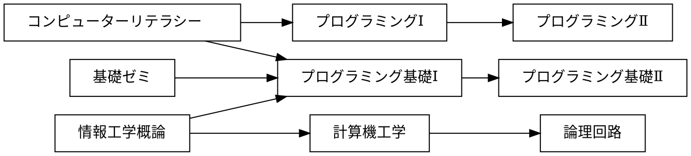

# 課題

## 課題 3.1 有向グラフ


プレビュー結果が上の図のようになるように，下記の記述を完成させよ．(接続関係が正しければ，上下が入れ替わっても構わない)

※ 日本語の文字列に対する箱の大きさが適切でない場合には，前後に空白を入れて調整せよ



## 課題 3.2 WBS


プレビュー結果が上の図のようになるように，下記の記述を完成させよ．(色や影などの違いは気にしなくてよい)

```plantUML
@startwbs uml01
* 拓殖大学 
** 商学部
*** 経営学科
*** 国際ビジネス学科
*** 会計学科
** 政経学部
*** 法律政治学科
*** 経済学科
*** 社会安全学科
** 外国語学部
*** 英米語学科
*** 中国語学科
*** スペイン語学科
*** 国際日本語学科
** 工学部
*** 機械システム学科
*** 電子システム学科
*** 情報工学科
*** デザイン学科
** 国際学部
*** 国際学科
@endwbs
```

## 課題 3.3 ユースケース図


プレビュー結果が上の図のようになるように，下記の記述を完成させよ．ただし，別名については適当に設定してよい．(色や影などの違いは気にしなくてよい)

```plantUML
@startuml usecase01
left to right direction
actor "学生" as S
actor "教員" as F
rectangle 履修管理システム {
    usecase "提出結果の採点" as 1
    usecase "リモートリポジトリにpush" as 2
    usecase "修正のコミット" as 3
    usecase "修正をステージに上げる" as 4
    usecase "課題ファイルの修正" as 5
    usecase "リポジトリのクローン" as 6
    usecase "課題の受領" as 7
    usecase "課題の登録" as 8
}
1 <-- F
S --> 2
S --> 3
S --> 4
S --> 5
S --> 6
S --> 7
8 <-- F
@enduml
```

## 課題 3.4 オリジナルの図解

「有向グラフ」「WBS」「ユースケース図」のどれかを使って，
独自の図解を作成せよ．対象は自由に決めてよいが，
誰かのコピーにならないように留意せよ．

```plantUML
@startwbs ex02
* デュエル・マスターズ
** 火文明
*** 凶戦士ブレイズクロー
*** コッコ・ルピア
*** 燃える革命 ドギラゴン
** 水文明
*** アクア・ガード
*** ドンドン吸い込むナウ
*** 禁断機関 VV-8
** 木文明
*** フェアリー・ライフ
*** ベイBジャック
*** 無頼妖精ホワイトベル
** 光文明
*** 予言の玉 クルト
*** Dの牢閣 メメント守神宮
*** ヘブンズ・ゲート
** 闇文明
*** 特攻人形ジェニー
*** デーモンハンド
*** S級不死 デットゾーン
** ゼロ文明
*** イズモ
*** 洗脳センノー
*** ジョリー・ザ・ジョニー
@endwbs
```


## チェック
- [x] 課題 3.1 有向グラフ
- [x] 課題 3.2 WBS
- [x] 課題 3.3 ユースケース図
- [x] 課題 3.4 オリジナルの図解
